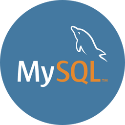

# CURSO DE MYSQL
👨‍⚖️MYSQL É UM SISTEMA DE GERENCIAMENTO DE BANCO DE DADOS, QUE UTILIZA A LINGUAGEM SQL COMO INTERFACE.

  

## CONCEITO:
O MySQL é um sistema de gerenciamento de banco de dados relacional de código aberto que foi lançado pela primeira vez em 1995. Foi desenvolvido pela empresa sueca MySQL AB, fundada por Michael Widenius, David Axmark e Allan Larsson. O objetivo era criar um banco de dados rápido, confiável e de fácil uso para aplicações web.

## SUA HISTÓRIA:
A primeira versão do MySQL, conhecida como MySQL 1.0, foi lançada em maio de 1995. Inicialmente, o foco era fornecer um banco de dados leve e eficiente para aplicativos baseados na web. Com o tempo, o MySQL ganhou popularidade por sua velocidade, confiabilidade e compatibilidade com várias plataformas.

Em 2000, o MySQL AB lançou a versão 3.23, que trouxe melhorias significativas de desempenho e funcionalidade. Foi nessa versão que o MySQL começou a ganhar destaque como um banco de dados de código aberto confiável e escalável, utilizado por empresas e desenvolvedores em todo o mundo.

Ao longo dos anos, o MySQL continuou a evoluir e a adicionar recursos avançados. Em 2001, a versão 4.0 foi lançada, introduzindo suporte para stored procedures, triggers e views, que são recursos essenciais para a programação de banco de dados e a manipulação de dados complexos.

Em 2005, o MySQL AB lançou a versão 5.0, que trouxe melhorias significativas de desempenho, escalabilidade e segurança. Essa versão também introduziu recursos avançados, como suporte a transações ACID (Atomicidade, Consistência, Isolamento e Durabilidade) e suporte a stored procedures em várias linguagens de programação.

Em 2008, o MySQL AB foi adquirido pela Sun Microsystems, que por sua vez foi adquirida pela Oracle Corporation em 2010. A aquisição gerou alguma preocupação na comunidade de usuários do MySQL devido à posição dominante da Oracle no mercado de bancos de dados.

No entanto, o MySQL continuou a se desenvolver sob a liderança da Oracle. Foram lançadas versões subsequentes, como o MySQL 5.1, 5.5, 5.6 e 5.7, que trouxeram melhorias contínuas de desempenho, segurança e escalabilidade.

Em 2013, a Oracle lançou o MySQL 5.6, que introduziu recursos avançados, como a replicação multithreaded para melhorar a escalabilidade e o desempenho, e o suporte a JSON (JavaScript Object Notation) para manipulação de dados semiestruturados.

Em 2015, o MySQL lançou a versão 5.7, que trouxe melhorias significativas de desempenho e segurança, além de recursos adicionais, como suporte a GIS (Geographic Information System) para armazenar e consultar dados geográficos.

Desde então, o MySQL continuou a se desenvolver e a lançar novas versões. Em 2019, foi lançado o MySQL 8.0, que trouxe recursos avançados, como suporte a transações distribuídas, aumento do desempenho de consultas e melhorias no gerenciamento de segurança.

Atualmente, o MySQL é amplamente utilizado em todo o mundo, desde pequenas aplicações pessoais até grandes sistemas corporativos. Sua popularidade se deve à sua combinação de desempenho, confiabilidade, escalabilidade e facilidade de uso. A comunidade do MySQL continua a crescer, com desenvolvedores e usuários contribuindo para seu desenvolvimento e suporte contínuo.

## CARACTERÍSTICAS:
### POSITIVAS:
- **Sistema de Gerenciamento de Banco de Dados Relacional:** MySQL é um sistema de gerenciamento de banco de dados relacional, projetado para armazenar, organizar e recuperar dados de maneira eficiente.

- **Open Source:** MySQL é uma plataforma de código aberto, permitindo acesso ao código-fonte e personalização conforme necessário.

- **Ampla Adoção:** É uma das bases de dados mais amplamente adotadas no mundo, sendo utilizado por uma variedade de aplicativos, desde pequenos sites até grandes empresas.

- **Suporte a Transações:** Oferece suporte a transações, permitindo operações atômicas, consistentes, isoladas e duráveis (ACID).

- **Rápido Desempenho:** É conhecido por seu desempenho rápido, especialmente em operações de leitura, e possui otimizações para consultas complexas.

- **Comunidade Ativa:** Possui uma comunidade ativa de desenvolvedores e usuários, fornecendo suporte, tutoriais e atualizações frequentes.

### NEGATIVAS:
- **Licenciamento para Algumas Implementações:** Embora seja de código aberto, o MySQL pode ter licenciamento comercial para certas implementações ou uso em contextos específicos.

- **Recursos Avançados Limitados na Versão Gratuita:** Alguns recursos avançados podem estar disponíveis apenas nas versões comerciais do MySQL, o que pode ser uma consideração para casos de uso específicos.

- **Menos Recursos de Business Intelligence Integrados:** Comparado a alguns concorrentes, o MySQL pode ter menos recursos integrados para análise de negócios e inteligência de negócios.

- **Curva de Aprendizado para Otimização:** A otimização e ajuste de desempenho do MySQL podem exigir conhecimento mais aprofundado, resultando em uma curva de aprendizado para maximizar o desempenho em casos específicos.

- **Menos Recursos de Segurança Avançados na Versão Gratuita:** Alguns recursos de segurança avançados podem ser limitados na versão gratuita, o que pode ser uma consideração para ambientes mais críticos.

- **Gestão Manual de Escalabilidade:** Em comparação com algumas soluções de banco de dados mais recentes, a escalabilidade pode exigir uma gestão mais manual em determinados casos.

## SUBSIDIOS:
- [CURSO CRIADO PELO "CURSO EM VIDEO"](https://youtube.com/playlist?list=PLHz_AreHm4dkBs-795Dsgvau_ekxg8g1r)
- [CURSO FEITO PELO VILHALVA](https://github.com/VILHALVA)
- [VEJA A DOCUMENTAÇÃO](https://dev.mysql.com/doc/)
- [VEJA A SINTAXE](./SINTAXE.md)
- [VEJA OS COMANDOS](./COMANDOS.md)
